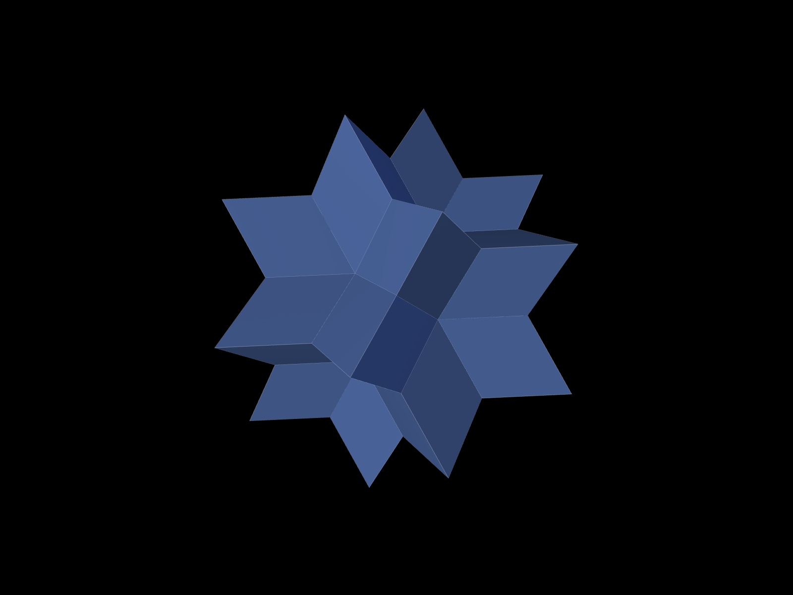

# Hexecontahedra

Interactive 3D visualizations of 32 different 60-faced polyhedra, viewable in a web browser.

## Polyhedra

| Shape | Face Type | Notes |
|-------|-----------|-------|
| Pentakis Dodecahedron | Isosceles triangles | Catalan solid |
| Deltoidal Hexecontahedron | Kites | Catalan solid |
| Pentagonal Hexecontahedron | Irregular pentagons | Catalan solid |
| Triakis Icosahedron | Isosceles triangles | Catalan solid |
| Rhombic Hexecontahedron | Golden rhombi | Concave form |
| Star Hexecontahedra (1-27) | Intersecting triangles | Procedurally generated uniform star-duals |

## Usage

Open `index.html` in a browser. Click any polyhedron to open the interactive viewer.

Controls: drag to rotate, scroll to zoom.

## Adding a polyhedron

1. Create `js/polyhedra/<name>.js` exporting vertex and face data
2. Import and register in `js/registry.js`

## Tech

Three.js, vanilla JS with ES modules, no build step.
